Развертывание Threat intelligence Platform OpenCTI
================
Хватов К.Л. БИСО-03-20

## Цель работы

1.  Освоить базовые подходы процессов Threat Intelligence
2.  Освоить современные инструменты развертывания контейнеризованных
    приложений
3.  Получить навыки поиска информации об угрозах ИБ

## Ход выполнения работы

## Шаг 1

Подготовка файлов кофигураций

Клонируем репозиторий с GitHub

`sudo git clone https://github.com/OpenCTI-Platform/docker.git`

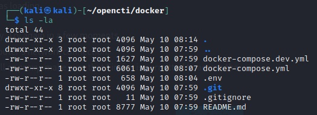

Генерируем UUID

`cat /proc/sys/kernel/random/uuid`

Увеличиваем виртуальную память

`sudo sysctl -w vm.max_map_count=1048575`

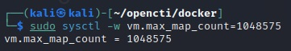

Конфигурируем файл `.env`

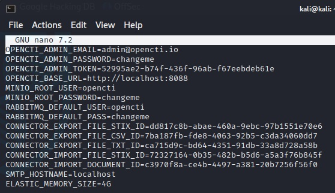

Дополнительная установка ELK

`docker pull elastic/elasticsearch:8.6.2`

## Шаг 2

Запускаем OpenCTI

Запуск контейнера в фоновом режиме

`sudo docker-compose up -d`

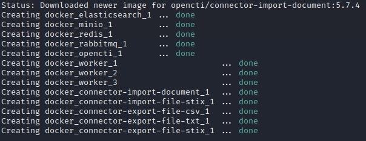

## Шаг 3

Перейдем в веб-интерфейс OpenCTI `localhost:8088`

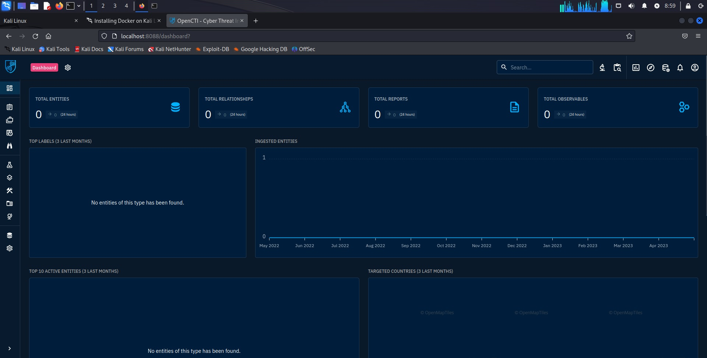

## Шаг 4

Зайдем на сайт с документацией по импорту файлов и увидем, что
существует библиотека python для работы с OpenCTI. Напишем код для
импорта файла в opencti:

``` python
import pycti
from datetime import datetime

date = datetime.today().strftime("%Y-%m-%dT%H:%M:%SZ")

api_url = 'http://localhost:8088'
api_token = '56ad8745-f2n5-781e-lw3h-658071gr2956'
client = pycti.OpenCTIApiClient(api_url, api_token)

with open('hosts.txt', 'r') as f:
    domains = f.read().splitlines()
k = 1
for domain in domains:
    indicator = client.indicator.create(
    name="HOST number  {}".format(k),
    description="For pr5 RTU MEMREA",
    pattern_type="stix",
    pattern="[domain-name:value = '{}']".format(domain),
    x_opencti_main_observable_type="IPv4-Addr",
    valid_from=date,
    update=True,
    score=75,
    )
    print("Created indicator with ID:", indicator["id"])
    k += 1
```

Ответ:

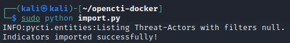

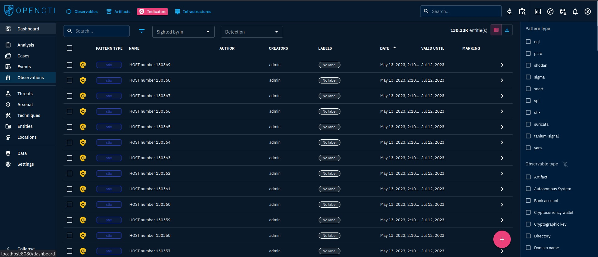

## Шаг 5

Преобразуем все индикаторы в Observables 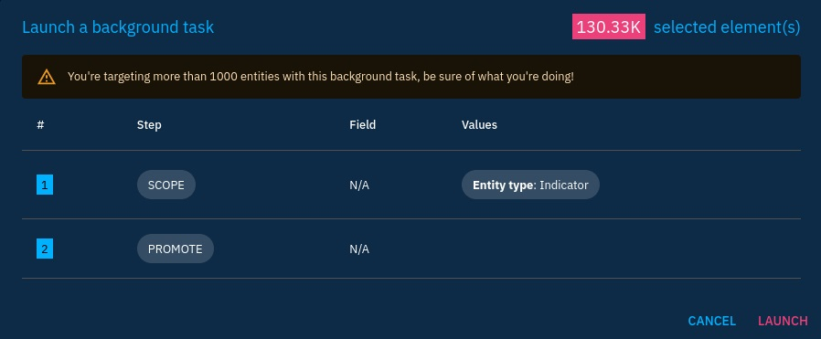

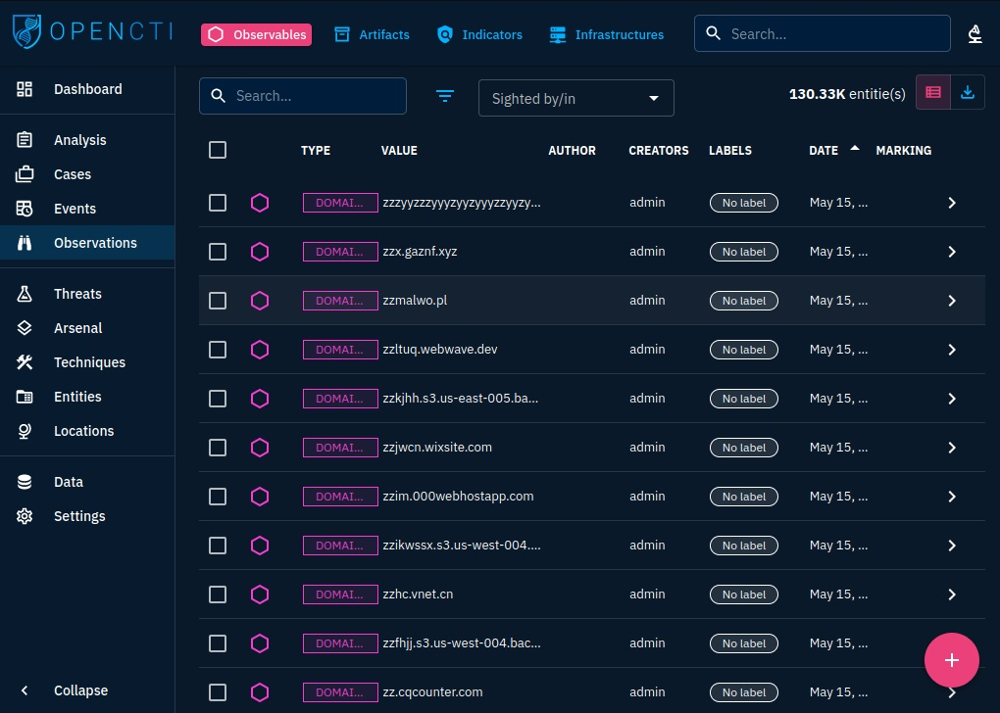

## Шаг 6

Импортируем сетевой трафик, полученный в lab_2 в OpenCTI 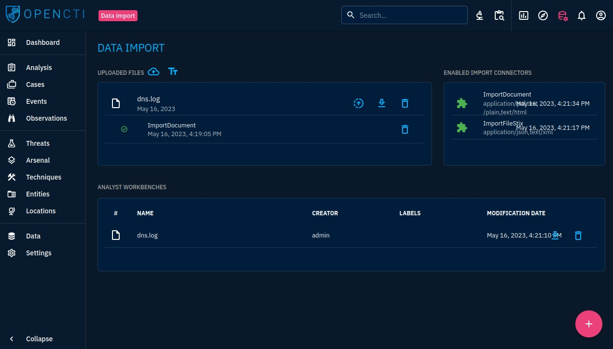

## Шаг 7

Добавим этот файл в рабочую область 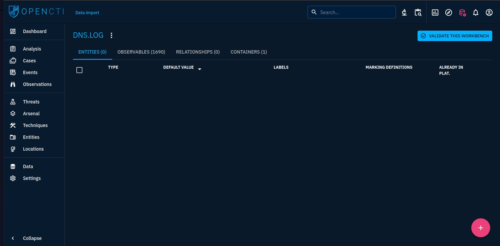

## Шаг 8

Перейдем в раздел с анализом и отфильтруем поиск по нежелательному
траффику 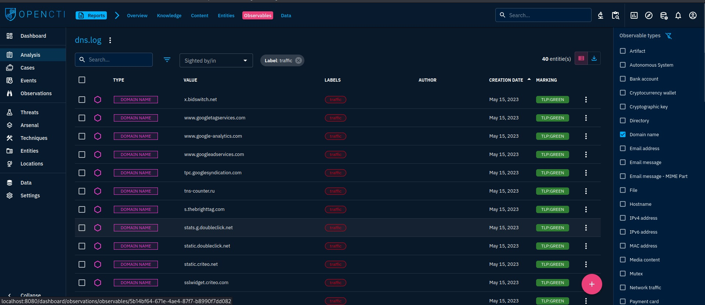

## Оценка результата

С помощью платформы OpenCTI удалось проанализировать трафик на предмет
перехода по нежелательным доменам.

## Выводы

Таким образом, были изучены возможности работы с платформой threat
intelligence OpenCTI
