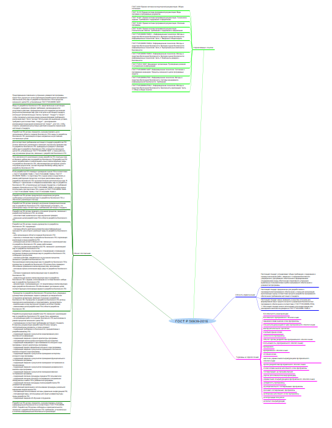
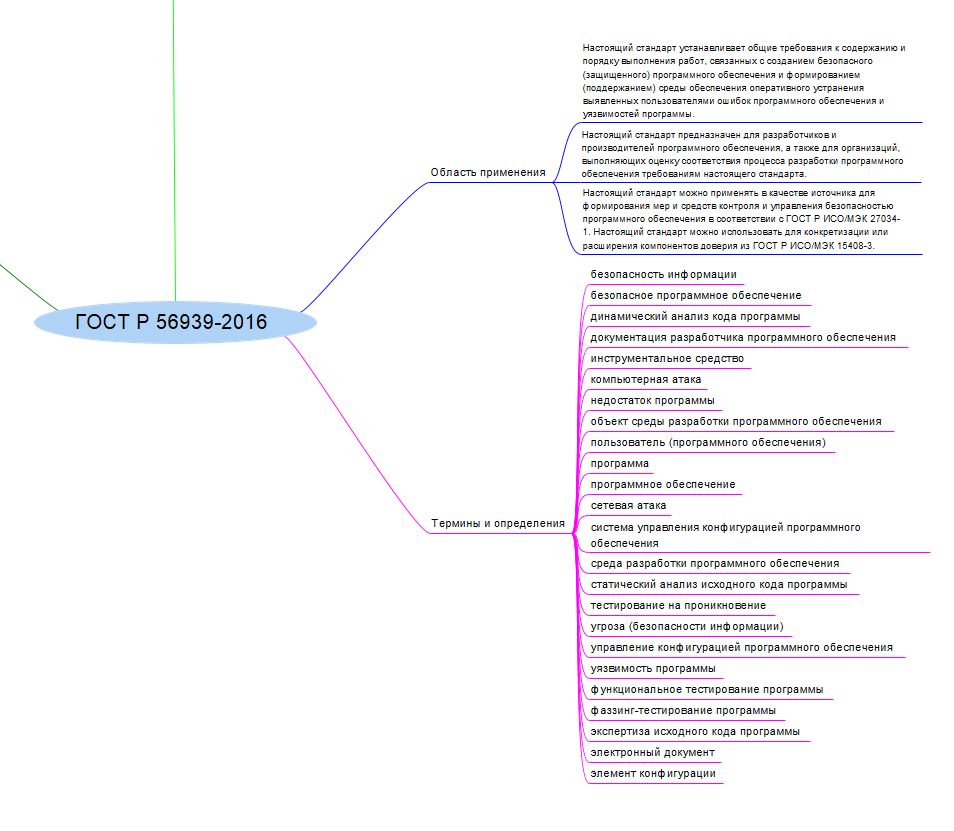
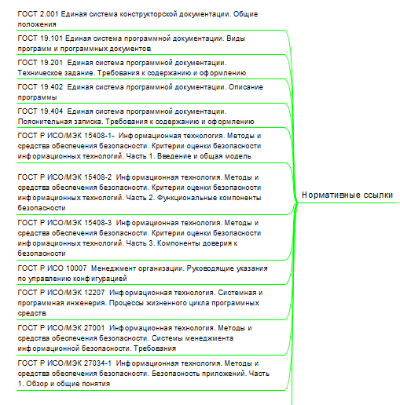
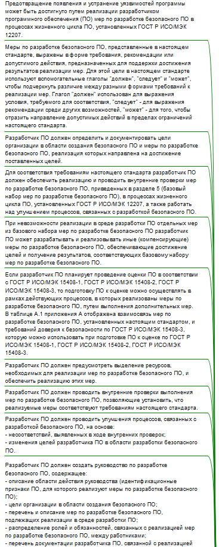
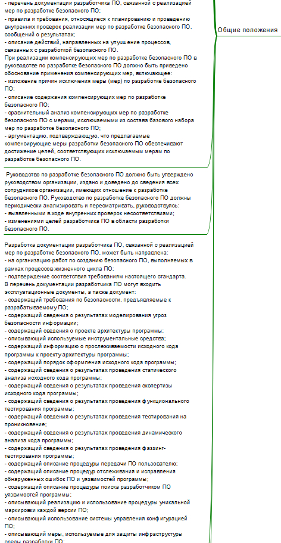
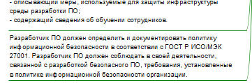

Работа с ментальной картой
================
Хватов К.Л. БИСО-03-20

## Цель работы

Изучить ГОСТ по защите информации и познакомиться с построением
mind-карты

## Ход работы

Для построения mind-карты был взят ГОСТ Р 56939-2016 Защита информации
Разработка безопасного ПО.

Ссылка на документ - https://docs.cntd.ru/document/1200135525

Была использована программа Freeplane

Результат

## Оценка результата

Был изучен ГОСТ Р 56939-2016 Защита информации
Разработка безопасного ПО. Основные термины и определения и была построена mind-карта
в программе Freeplane.

## Вывод

Таким образом, был изучен ГОСТ и правила построения mind-карт.
